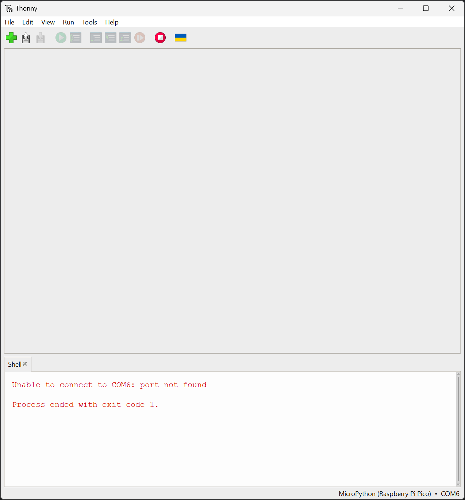
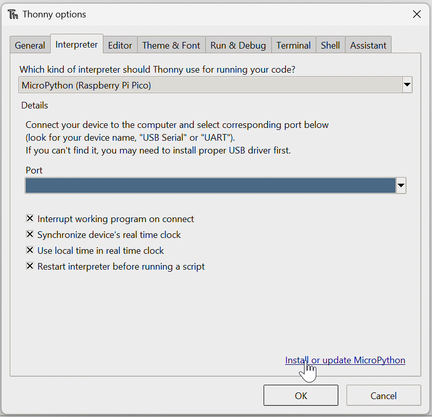
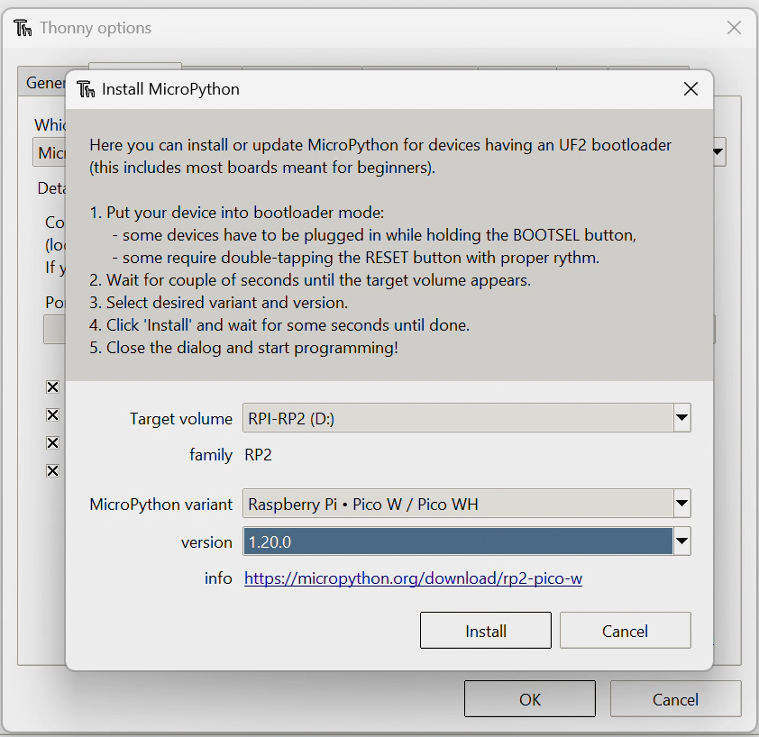
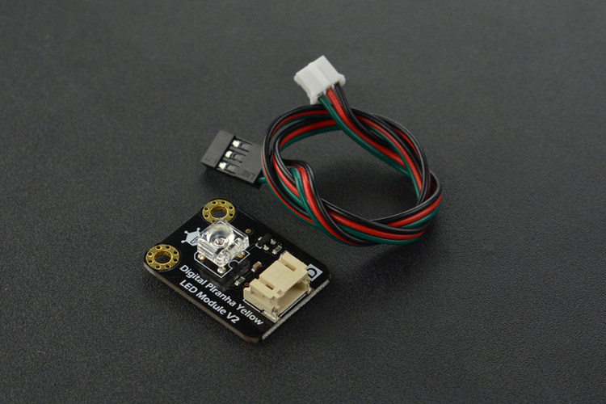
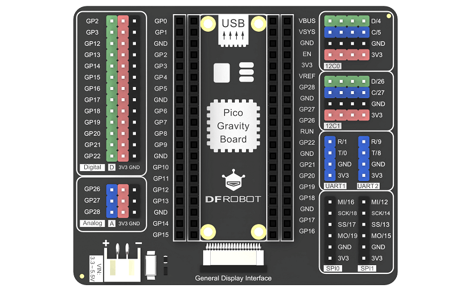
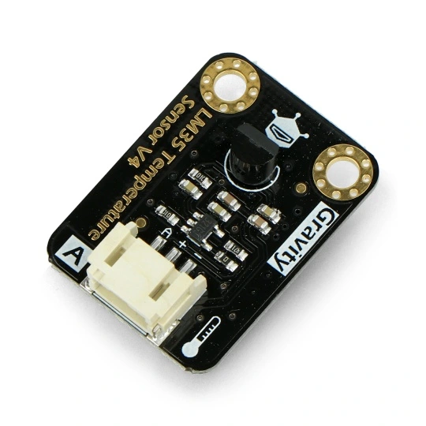
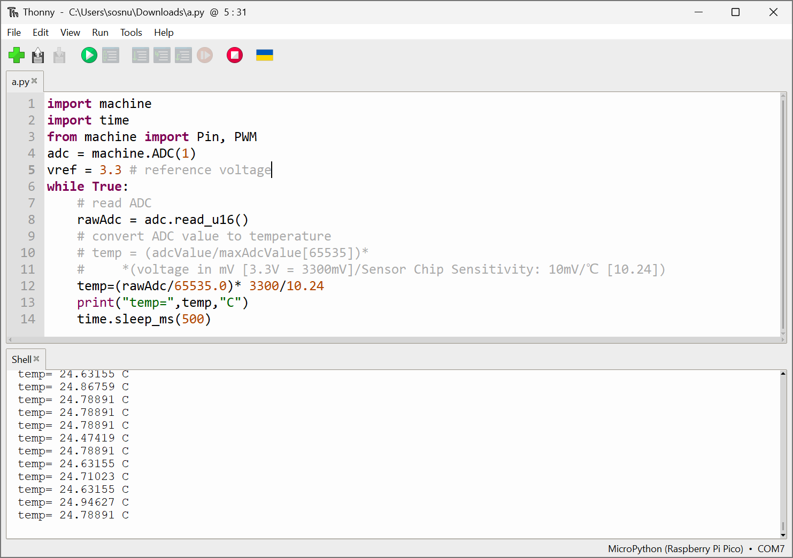
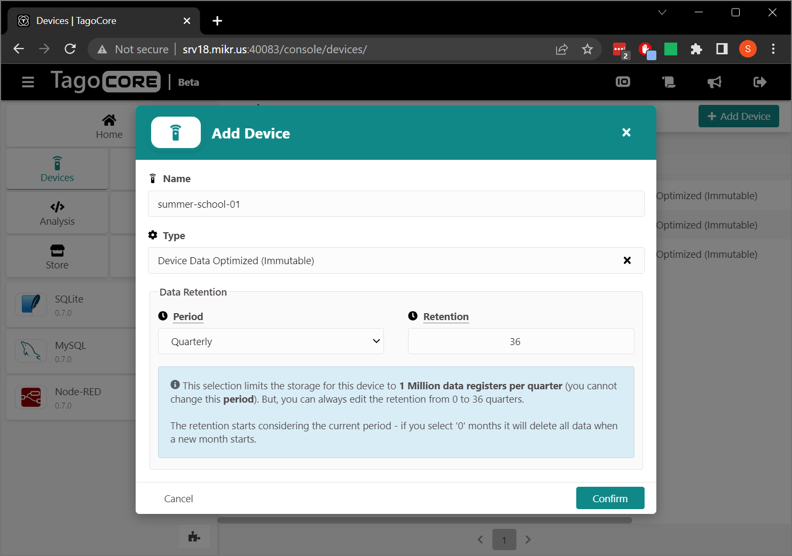
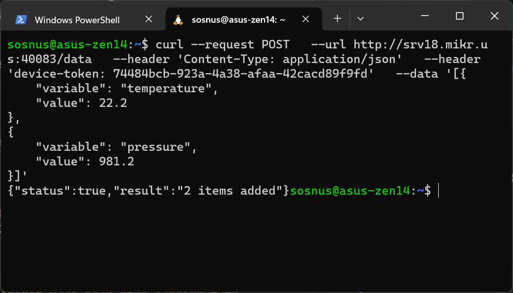
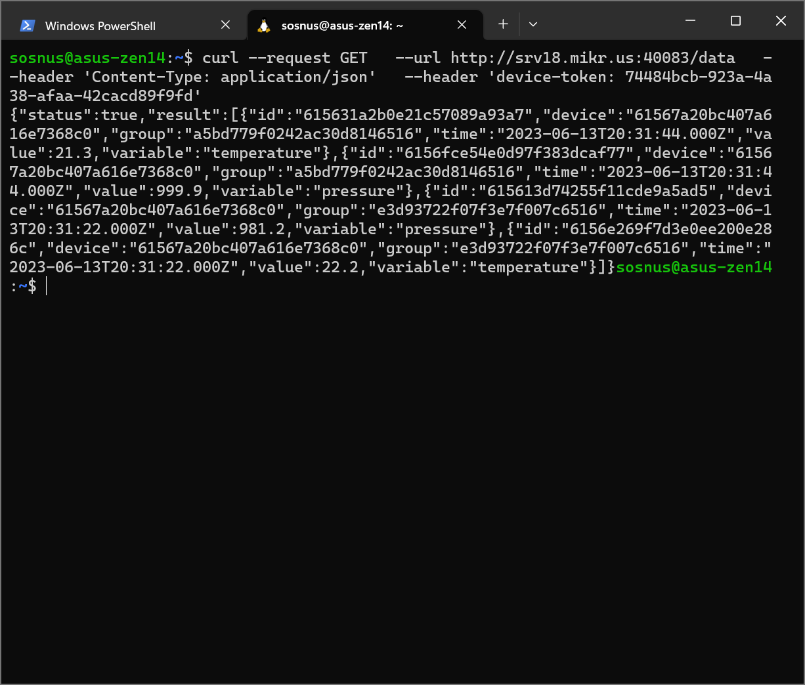

# Workshop
## Before You start
1. Do You have installed Thonny IDE (simplest way to develop project using Rpi Pico and Python)?
    * If not, follow this tutorial: https://projects.raspberrypi.org/en/projects/get-started-pico-w/0
2. Your Thonny IDE working with Rpi Pico W? You can deploy Your file written in Python to Pico W?
    * If not, follow this tutorial: https://projects.raspberrypi.org/en/projects/get-started-pico-w/1
3. Could You connect Rpi Pico to WiFI network?
    * If not, follow this tutorial: https://projects.raspberrypi.org/en/projects/get-started-pico-w/2 and ask about WiFI credentials

## Part 1: First step with RPi Pico nad sensors
### Install bootloader
Steps:
1. Run `Thonny IDE`



2. Plug in `RPi Pico WH` to computer via cable USB micro
3. Open `Tools`>`Options...`


4. Click `Install or update MicroPython`



5. Read instruction and select newest, stable version of bootloader



6. Click `Install`
7. After a lot of seconds we see label `Done`. Now we must close all windows of Thonny and back to main window of this IDE
8. Open `Tools`>`Options...` one more time - now You must see new Port COM on `Port` list:


9. Select this new port and press `OK`
10. If everything is OK, You must see in console this text:
```
MicroPython v1.20.0 on 2023-04-26; Raspberry Pi Pico W with RP2040

Type "help()" for more information.

>>> 
```
 

11. It is time to connect everything together
    1. Connect `Rpi Pico WH` with DFRobot shield, then connect led module to pin `GP2`



12. Now we can write first program. Click on `+` ("Plus") symbol on top left corner of IDE
13. Paste this snipet into editor:
```Python
from machine import Pin
led = Pin(2, Pin.OUT) # we use GP2, becouse it is first port on headers
import time 
while True: 
  led.value(1) 
  time.sleep_ms(500) 
  led.value(0) 
  time.sleep_ms(500)
```

14. And click `RUN` symbol:


15. led shoud blink with interval 0,5 seconds

16. Connect sensor to `RPi Pico WH`, in this sample project, we use `DFRobot Analog Ambient Light Sensor V2.1` - we should connect this sensor to pin `GP27`



17. Paste this simple program to `Thonny IDE`, save file and press `RUN` symbol
``` Python
import machine
import time
from machine import Pin, PWM
adc = machine.ADC(1)
vref = 3.3 # reference voltage
while True:
    # read ADC
    rawAdc = adc.read_u16()
    # convert ADC value to temperature
    # temp = (adcValue/maxAdcValue[65535])*
    #     *(voltage in mV [3.3V = 3300mV]/Sensor Chip Sensitivity: 10mV/℃ [10.24])
    temp=(rawAdc/65535.0)* 3300/10.24
    print("temp=",temp,"C")
    time.sleep_ms(500)
```

18. In shell You can see value from temperature sensor


19. Now You can try use another digital or analog sensor!

## Part 2: Network connection and send data to Tago Core
During first part we learn how to run program using `Thonny IDE` and how to read data from sensors. Now it is time to send data to the cloud!

### Part 2 a: Send data to Tago Core (from console)
You can communicate with service `Tago Core` using REST API. If You need send data to cloud, You need only two variables:
1. server address
2. token

Only `Tago Core` administrator can add, change or remove devices. Ask about Your credential (token) during workshop. The training instructor will create the device for you and provide You with access data.


If You receive credentials, You can test connection using console program `cURL`

`Tago Core` receives and returns data in `JSON` format. It is array with one or more variables. Fields `variable` and `value`.
* `variable` should be `String`
* `value` could be `Int`, `Float` or `String`
* OPTIONAL: `timestamp` - `Int` - if You do not add this parameter, server use current timestamp value. 

EXAMPLE: If You want send data about temperature and pressure, You can send `JSON` object like this:
``` JSON
[{
    "variable": "temperature",
    "value": 22.2
},
{
    "variable": "pressure",
    "value": 981.2
}]
```
And You have `token`: `74484bcb-923a-4a38-afaa-42cacd89f9fd`
and `address`: `http://srv18.mikr.us:40083/data`
You can build `cURL` request:
``` Bash
curl --request POST \
  --url http://srv18.mikr.us:40083/data \
  --header 'Content-Type: application/json' \
  --header 'device-token: 74484bcb-923a-4a38-afaa-42cacd89f9fd' \
  --data '[{
    "variable": "temperature",
    "value": 22.2
},
{
    "variable": "pressure",
    "value": 981.2
}]'
```
This request could be send from console using `cURL`:

We receive response:
``` Bash
{
	"status": true,
	"result": "2 items added"
}
```
So `Tago Core` write our 2 variables to database.

Now we can read Our data using `GET` request:
``` Bash
curl --request GET \
  --url http://srv18.mikr.us:40083/data \
  --header 'Content-Type: application/json' \
  --header 'device-token: 74484bcb-923a-4a38-afaa-42cacd89f9fd'
```

In console this message is very hard to read, but If we format this like JSON, we can see:
``` JSON
{
	"status": true,
	"result": [
		{
			"id": "615631a2b0e21c57089a93a7",
			"device": "61567a20bc407a616e7368c0",
			"group": "a5bd779f0242ac30d8146516",
			"time": "2023-06-13T20:31:44.000Z",
			"value": 21.3,
			"variable": "temperature"
		},
		{
			"id": "6156fce54e0d97f383dcaf77",
			"device": "61567a20bc407a616e7368c0",
			"group": "a5bd779f0242ac30d8146516",
			"time": "2023-06-13T20:31:44.000Z",
			"value": 999.9,
			"variable": "pressure"
		},
		{
			"id": "615613d74255f11cde9a5ad5",
			"device": "61567a20bc407a616e7368c0",
			"group": "e3d93722f07f3e7f007c6516",
			"time": "2023-06-13T20:31:22.000Z",
			"value": 981.2,
			"variable": "pressure"
		},
		{
			"id": "6156e269f7d3e0ee200e286c",
			"device": "61567a20bc407a616e7368c0",
			"group": "e3d93722f07f3e7f007c6516",
			"time": "2023-06-13T20:31:22.000Z",
			"value": 22.2,
			"variable": "temperature"
		}
	]
}
```
`Tago Core` add a lot of metadata to our variables:
* `id` - unique ID of this object
* `device` - unique Id of device (in HEX)
* `group` - metadata, not important for us
* `time` - time, when this object was written
* `value` - value of variable
* `variable` - name of variable

We will deal with data processing later, now it's time to do it using `Raspberry Pico WH`

### Part 2 b: Send data to Tago Core (from Rpi Pico)?


### How to read data from Tago Core?

#### Read data from Tago Core using Grafana


#### Read data from Tago Core using Rest API
https://help.tago.io/portal/en/kb/articles/36-getting-data
https://help.tago.io/portal/en/kb/articles/31-api-overview